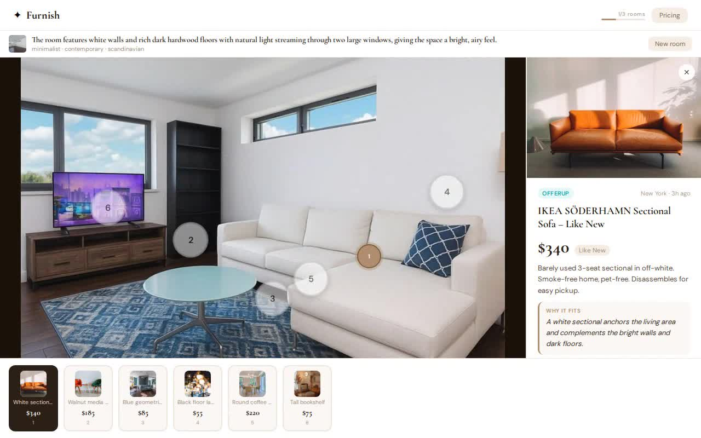
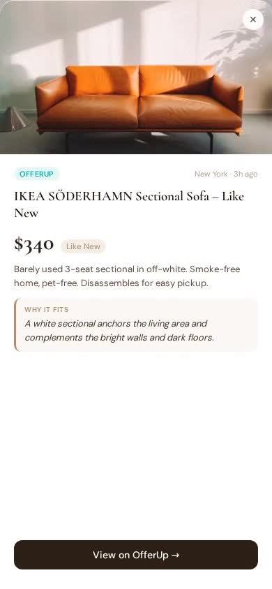
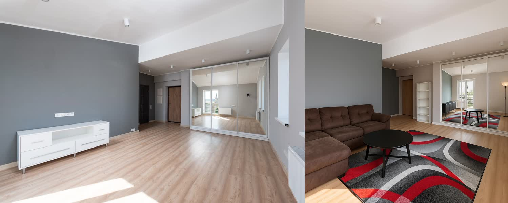
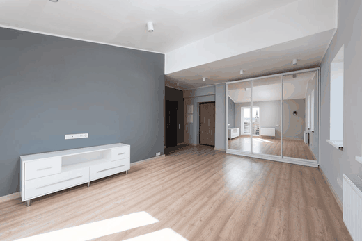
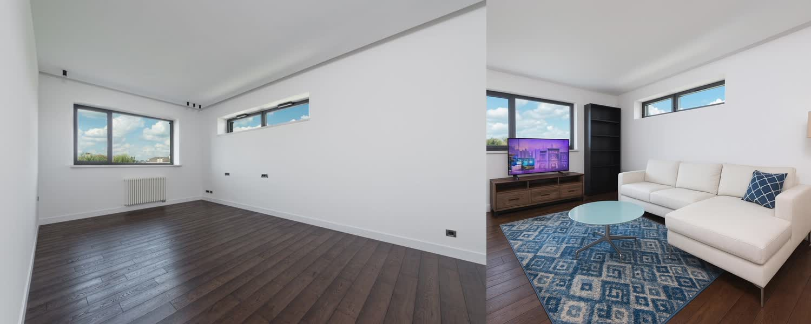
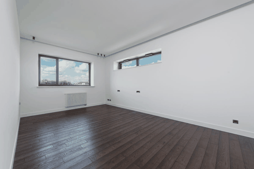

# Furnish ✦

> Upload a photo of your empty room. AI furnishes it with real secondhand listings from Mercari and OfferUp — and shows you exactly where each piece goes.

---

## Demo

### Desktop — full workflow
https://github.com/KM101304/Furnish/raw/main/docs/demo_desktop.mp4

[](docs/demo_desktop.mp4)

*Upload → AI analysis → furnished render → click hotspots → see real listings → buy*

---

### Mobile — iPhone layout
https://github.com/KM101304/Furnish/raw/main/docs/demo_mobile.mp4

[](docs/demo_mobile.mp4)

*Same flow on mobile — bottom sheet listing panel, touch-optimized hotspots*

---

## Before → After

### Room 1 — Minimalist apartment (Los Angeles)


*Empty grey apartment → sectional sofa, coffee table, bookshelf, area rug — all real OfferUp listings*

| Animated |
|----------|
|  |

---

### Room 2 — Bright open room (New York)


*Empty white room with dark floors → white sectional, media console, blue area rug, floor lamp — real secondhand listings*

| Animated |
|----------|
|  |

---

---

## How it works

1. **Upload 1–4 photos** of your empty room
2. **GPT-4o Vision** analyzes the space — dimensions, style, what it needs
3. **6 furniture slots** are matched to real Mercari + OfferUp listings in your city, filtered by style
4. **gpt-image-1** generates a furnished render of your actual room using the real listing photos as references
5. **Tap any numbered dot** on the render to see the listing: photo, price, condition, direct link to buy

---

## Pricing

| Plan | Price | Rooms/month |
|------|-------|-------------|
| Free | $0 | 3 |
| Starter | $12/month | 20 |
| Pro | $24/month | Unlimited |

---

## Stack

| Layer | Tech |
|---|---|
| Frontend | React + Vite |
| Backend | Node.js + Express |
| Auth | Clerk |
| Billing | Stripe |
| AI — Room analysis | GPT-4o Vision |
| AI — Room render | gpt-image-1 image edit |
| AI — Style tagging | GPT-4o-mini (scraper pipeline) |
| Database | SQLite (dev) / PostgreSQL (prod) |
| Listings | OfferUp + Mercari scrapers |

---

## Setup

### Prerequisites
- Node.js 18+
- OpenAI API key with access to `gpt-4o` and `gpt-image-1`
- (Optional) Clerk account for auth, Stripe for billing

### 1. Clone and install

```bash
git clone https://github.com/KM101304/Furnish.git
cd Furnish
cd backend && npm install
cd ../frontend && npm install
```

### 2. Configure environment

```bash
cp backend/.env.example backend/.env
# Add OPENAI_API_KEY at minimum
# Add CLERK_SECRET_KEY + Stripe keys for full SaaS mode

cp frontend/.env.example frontend/.env
# Add VITE_CLERK_PUBLISHABLE_KEY for auth UI
```

### 3. Seed the listings database

```bash
cd backend && npm run scrape
# Scrapes OfferUp (+ Mercari if reachable) and saves to furnish.db
```

### 4. Run

```bash
# Backend (port 3001)
cd backend && npm run dev

# Frontend (port 5173)
cd frontend && npm run dev
```

Open [http://localhost:5173](http://localhost:5173)

> **Dev mode:** If `CLERK_SECRET_KEY` is not set, auth is bypassed and all requests run as Pro. Set it to enforce free tier limits.

---

## Project structure

```
Furnish/
├── backend/
│   ├── lib/
│   │   └── openai.js           # Shared OpenAI singleton
│   ├── middleware/
│   │   ├── requireAuth.js      # Clerk JWT verification
│   │   └── requireUsage.js     # Plan limit enforcement
│   ├── routes/
│   │   ├── furnish.js          # Room analysis + listing match (GPT-4o Vision)
│   │   ├── render.js           # Furnished room render (gpt-image-1)
│   │   ├── history.js          # User's saved room analyses
│   │   ├── billing.js          # Stripe checkout + webhook + portal
│   │   └── listings.js         # Listing query endpoint
│   ├── scrapers/
│   │   ├── offerup.js          # OfferUp via __NEXT_DATA__
│   │   └── mercari.js          # Mercari via api.mercari.us
│   ├── jobs/
│   │   └── scrape-cron.js      # Runs every 4h
│   ├── db/
│   │   ├── index.js            # SQLite (users + listings + analyses tables)
│   │   ├── users.js            # User CRUD + plan management
│   │   ├── analyses.js         # Room history storage
│   │   └── listings.js         # Listing query helpers
│   └── server.js               # Express + CORS + helmet + rate limiting
│
└── frontend/
    └── src/
        ├── App.jsx             # Main app + screen state machine
        ├── components/
        │   ├── UploadZone.jsx  # Drag/drop + file input
        │   ├── ListingPanel.jsx # Sliding detail panel
        │   ├── ResultsBar.jsx  # Bottom thumbnail strip
        │   ├── UsageBar.jsx    # Plan usage indicator
        │   ├── Pricing.jsx     # Pricing page + Stripe checkout
        │   ├── HistoryView.jsx # Past room analyses grid
        │   └── ErrorBoundary.jsx
        └── api/
            ├── furnish.js
            └── render.js
```

---

## How the render works

`/api/render` passes **multiple images** to `gpt-image-1`:
- Image 1: the user's room photo
- Images 2–7: actual listing product photos from OfferUp/Mercari

The model places each specific item at its described position in the room, preserving floors, walls, and architecture. The generated render shows furniture that looks like the actual items for sale.

---

## Mobile

Fully optimized for iOS Safari:
- `viewport-fit=cover` + `env(safe-area-inset-bottom)` for notch/home indicator
- `100dvh` for correct height with collapsing URL bar
- 44px minimum tap targets on hotspot dots
- Bottom sheet panel on mobile, side panel on desktop

---

## License

MIT — see [LICENSE](LICENSE)
